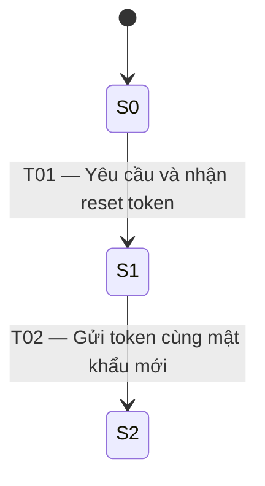

# Báo cáo State Transition Testing — `1.3 / 1.4 — Password-reset lifecycle`

## Thông tin báo cáo

| Trường | Giá trị |
|---|---|
| Tính năng | `1.3 / 1.4 — Password-reset lifecycle` |
| Kỹ thuật | `State Transition Testing` |
| Nguồn yêu cầu | `api_specification.md`, §1.3 và §1.4 |
| Ngày lập báo cáo | `2026-07-06` |
| Trạng thái thiết kế | Hoàn tất ba phase; còn test bị chặn do yêu cầu chưa đầy đủ |
| Thực thi kiểm thử | Chưa thực thi; báo cáo này chỉ phản ánh thiết kế kiểm thử |

## Tóm tắt điều hành

Password-reset lifecycle được đánh giá phù hợp **Medium** với State Transition Testing vì thao tác reset tại §1.4 phụ thuộc vào token được tạo ở bước trước theo §1.3, nhưng đặc tả không mô tả đầy đủ vòng đời token và kết quả quan sát được của việc reset.

Thiết kế hiện có 3 trạng thái, 3 event/action, 3 transition và 3 test case chi tiết. Cả 3 transition đều đã được ánh xạ vào test case, đạt **100% design mapping coverage**. Tuy nhiên, chỉ T01 có expected result hoàn toàn dựa trên đặc tả. T02 chỉ thực thi được một phần và T03 bị chặn. Vì chưa chạy test, báo cáo không đưa ra kết luận pass/fail về hệ thống.

| Chỉ số | Số lượng |
|---|---:|
| Trạng thái | 3 |
| Event/action | 3 |
| Transition hợp lệ | 2 |
| Transition không hợp lệ | 1 |
| Test case hợp lệ | 2 |
| Test case không hợp lệ | 1 |
| Test case thực thi đầy đủ | 1 |
| Test case thực thi một phần | 1 |
| Test case bị chặn | 1 |
| Test case đã chạy | 0 |

## Phạm vi và lựa chọn tính năng

Phase 1 khảo sát toàn bộ §§1–6 của `api_specification.md`. Order lifecycle được đề xuất ban đầu vì có mức phù hợp High, nhưng người dùng đã chủ động chọn **§1.3 / §1.4 — Password-reset lifecycle** cho Phase 2 và Phase 3. Lựa chọn này vẫn hợp lệ cho STT vì §1.4 có quan hệ lịch sử với token từ §1.3, dù nhiều transition quan trọng chưa được quy định.

Phạm vi bao gồm:

- Yêu cầu reset token qua `POST /api/forgot-password`.
- Nhận `resetToken` từ phản hồi thành công.
- Gửi email, token và mật khẩu mới qua `POST /api/reset-password`.
- Trường hợp gửi reset request khi chưa nhận token trong luồng quan sát.

Ngoài phạm vi:

- Đăng ký, đăng nhập thông thường và cập nhật hồ sơ.
- UI, điều hướng và việc gửi email thực tế.
- Cách lưu token trong backend.
- Chính sách mật khẩu, retry/rate limit và lockout.
- Trạng thái JWT/session sau khi reset.
- Hành vi implementation không được nêu trong đặc tả.

## Cơ sở yêu cầu và phân loại

### Yêu cầu tường minh

- **§1.3:** `POST /api/forgot-password` nhận body có `email`.
- **§1.3:** phản hồi thành công được mô tả là `200 OK`, có thông báo tạo mã reset và trường `resetToken` với giá trị được tài liệu hóa là `123456`.
- **§1.4:** `POST /api/reset-password` nhận `email`, `resetToken` và `newPassword`.
- **§1.4:** tên mục xác định mục đích endpoint là đặt lại mật khẩu.

### Suy luận logic

- Token được tạo ở §1.3 là dữ liệu được dùng làm `resetToken` ở §1.4 trong cùng luồng reset.
- Nếu §1.4 hoàn tất thành công với dữ liệu được chấp nhận, trạng thái đích logic là mật khẩu đã được reset (S2).
- Gửi §1.4 từ S0 bằng token không nhận được qua §1.3 được xem là invalid-transition candidate T03.

Các suy luận trên được ghi nhãn rõ ràng; chúng không bổ sung HTTP status, response body hoặc cơ chế kiểm tra mật khẩu đã đổi.

### Giả định

Không có giả định nào được nhận làm yêu cầu. Đặc biệt, báo cáo không giả định token hết hạn, dùng một lần, bị thay thế, có độ dài cố định, hoặc làm mất hiệu lực session hiện tại.

### Yêu cầu chưa được quy định

- Response status và body khi §1.4 thành công.
- Cách quan sát và xác nhận S2.
- Quan hệ bắt buộc giữa token và email.
- Phản hồi cho email không tồn tại, token sai, token lệch email hoặc chưa từng yêu cầu token.
- Thời hạn token và quy tắc clock/timezone.
- Token dùng một lần hay có thể tái sử dụng.
- Ảnh hưởng của việc yêu cầu token mới lên token cũ.
- Chính sách mật khẩu, retry, rate limit và lockout.
- Ảnh hưởng lên mật khẩu cũ và các JWT/session hiện có.

## Mô hình trạng thái

### Trạng thái

| ID | Trạng thái | Ý nghĩa quan sát được | Cơ sở/phân loại |
|---|---|---|---|
| S0 | Chưa nhận reset token | Trong execution record hiện tại chưa có phản hồi §1.3 thành công chứa token cho email đang kiểm thử; không khẳng định dữ liệu ẩn phía server. | Baseline của workflow; trạng thái token lưu trữ ban đầu không được quy định. |
| S1 | Đã nhận reset token | Phản hồi thành công của §1.3 đã trả về một `resetToken` cụ thể. | Tường minh từ §1.3. |
| S2 | Đã hoàn tất reset mật khẩu | Trạng thái đích logic sau khi §1.4 được thực hiện thành công với email, token và mật khẩu mới. | Suy luận logic từ mục đích §1.4; cách quan sát là `Unspecified`. |

### Event và action

| ID | Event/action | Guard hoặc trigger | Cơ sở/phân loại |
|---|---|---|---|
| E1 | Gọi `POST /api/forgot-password` | Gửi một email; không có guard về account existence trong đặc tả. | Tường minh từ §1.3. |
| E2 | Gọi `POST /api/reset-password` | Gửi email, token đã nhận trong cùng workflow và mật khẩu mới. | Các field tường minh ở §1.4; liên hệ token-email là suy luận logic. |
| E3 | Gọi reset khi chưa nhận token qua E1 | Bắt đầu tại S0 và gửi một token không được trả về trong execution hiện tại. | Invalid-transition candidate; kết quả bị `Unspecified`. |

Đặc tả không cung cấp timeout hoặc time event, nên mô hình không có transition theo thời gian.

### Sơ đồ trạng thái

T03 không được đưa vào sơ đồ vì trạng thái đích chưa được đặc tả. Việc vẽ T03 quay lại S0 sẽ tự ý giả định rằng request lỗi không làm đổi trạng thái.

### State Transition Table

| Start | Action | End | Valid/Invalid |
|---|---|---|---|
| S0 | T01 — Gửi email tới §1.3 và nhận response thành công có `resetToken` | S1 | Valid |
| S1 | T02 — Gửi email của workflow, token vừa nhận và `newPassword` tới §1.4 | S2 | Valid |
| S0 | T03 — Gửi §1.4 bằng token không nhận được từ §1.3 trong workflow hiện tại | Unspecified | Invalid |

T02 được xem là valid theo mục đích của §1.4 nhưng chưa có oracle đủ để xác nhận S2. T03 được phân loại invalid theo suy luận logic, nhưng đặc tả chưa cho phép khẳng định request bị từ chối hoặc trạng thái không đổi.

## Bao phủ luồng

Thiết kế chọn **end-to-end flow** thay cho 1-switch paths vì đây là lifecycle ngắn qua hai endpoint và không có đủ yêu cầu để mô hình hóa đáng tin cậy các cặp transition liên quan tới hết hạn, thay token hoặc tái sử dụng.

| Path | Chuỗi transition | Test case | Trạng thái |
|---|---|---|---|
| F1 | `S0 --T01--> S1 --T02--> S2` | `STT-PASSWORD-RESET-V-002` | Bao phủ về thiết kế; assertion của T02 bị chặn. |
| F2 | `S0 --T03--> Unspecified` | `STT-PASSWORD-RESET-I-001` | Negative path bị chặn; không có rejection oracle hoặc trạng thái đích. |

## Danh mục test case chi tiết

| TC ID | Loại | Kịch bản | Start/end | Dữ liệu chính | Phạm vi expected result | Mức sẵn sàng | File |
|---|---|---|---|---|---|---|---|
| `STT-PASSWORD-RESET-V-001` | Valid | Yêu cầu và nhận reset token | S0 → S1 | `test@domain.com`; token tài liệu hóa `123456` | Có thể kiểm tra `200 OK`, message và `resetToken` theo §1.3. | **Executable** | [Chi tiết](test-cases.md#stt-password-reset-v-001) |
| `STT-PASSWORD-RESET-V-002` | Valid | Thực hiện luồng nhận token rồi gửi reset | S0 → S1 → S2 | `test@domain.com`; `123456`; `NewPassword123!` | T01 có oracle; T02 không có response hay cách chứng minh S2. | **Partial** | [Chi tiết](test-cases.md#stt-password-reset-v-002) |
| `STT-PASSWORD-RESET-I-001` | Invalid | Gửi reset bằng token chưa nhận qua §1.3 | S0 → Unspecified | `test@domain.com`; `000000`; `NewPassword123!` | Không có rejection response, password effect hoặc trạng thái đích. | **Blocked** | [Chi tiết](test-cases.md#stt-password-reset-i-001) |

### Điều kiện thiết lập chung

- API khả dụng tại `http://localhost:3000`.
- Mỗi test bắt đầu bằng execution record tách biệt.
- S0 được thiết lập bằng bằng chứng phía test client: chưa gọi/capture response §1.3 cho email trong execution hiện tại.
- Không giả định trực tiếp giá trị trong database hoặc trạng thái token ẩn phía server.

## Tổng hợp coverage

| Thước đo | Covered | Total | Kết quả/ghi chú |
|---|---:|---:|---|
| Valid transitions được ánh xạ vào TC | 2 | 2 | 100% design mapping; T02 chưa có oracle đầy đủ. |
| Invalid transitions được ánh xạ vào TC | 1 | 1 | 100% design mapping; T03 bị chặn. |
| Tất cả transition được ánh xạ vào TC | 3 | 3 | **100% design mapping coverage**. |
| Transition thực thi đầy đủ bằng expected result có căn cứ | 1 | 3 | **33,3% executable transition coverage**; chỉ T01. |
| Test case thực thi đầy đủ | 1 | 3 | V-001. |
| Test case thực thi một phần | 1 | 3 | V-002; chỉ T01 có oracle. |
| Test case bị chặn hoàn toàn | 1 | 3 | I-001. |
| Test case đã thực thi | 0 | 3 | Không có execution evidence; không báo cáo pass/fail. |

Design mapping coverage không đồng nghĩa với khả năng thực thi hay chất lượng oracle. Con số 100% chỉ nói rằng mỗi transition trong mô hình đều có test case liên kết.

## Ma trận traceability

| Requirement | State/event | Transition | Path | Detailed TC | Mức sẵn sàng |
|---|---|---|---|---|---|
| §1.3 — gửi email và nhận `resetToken` | S0, S1, E1 | T01 | F1 | `STT-PASSWORD-RESET-V-001`, `STT-PASSWORD-RESET-V-002` | Executable |
| §1.4 — gửi email, token và mật khẩu mới | S1, S2, E2 | T02 | F1 | `STT-PASSWORD-RESET-V-002` | Partial; S2 không quan sát được theo đặc tả |
| §§1.3–1.4 — tạo token trước khi dùng | S0, E3 | T03 | F2 | `STT-PASSWORD-RESET-I-001` | Blocked; đây là suy luận logic và không có rejection oracle |

## Khoảng trống, test bị chặn và rủi ro

| Khoảng trống | Phân loại | Artifact bị ảnh hưởng | Tác động |
|---|---|---|---|
| Không có status/body thành công của §1.4 | `Unspecified` | S2, T02, V-002, F1 | Không thể viết expected response hoặc xác nhận hoàn tất reset. |
| Không có phương pháp quan sát S2 | `Unspecified` | S2, T02, V-002 | Không biết nên kiểm tra login bằng mật khẩu mới, từ chối mật khẩu cũ hay tín hiệu khác. |
| Không có quy tắc token-email và token sai | `Unspecified` | E3, T03, I-001, F2 | Không thể khẳng định token `000000` bị từ chối hoặc state giữ nguyên. |
| Không có expiry/timezone | `Unspecified` | Mô hình state/time | Không thể thiết kế expired-token transition. |
| Không có quy tắc single-use/reuse | `Unspecified` | Mô hình state, invalid inventory | Không thể phân loại lần dùng token thứ hai. |
| Không có quy tắc thay token | `Unspecified` | Repeated E1 paths | Không biết token cũ còn hiệu lực sau lần yêu cầu mới. |
| Không có chính sách password/retry/rate limit | `Unspecified` | Test inventory | Không thể thêm state counter, lock hoặc negative transition tương ứng. |
| Không có quy tắc session sau reset | `Unspecified` | Phạm vi xác thực | Không thể đánh giá JWT/session đang tồn tại. |

Rủi ro chính là **oracle risk**: nếu test tự đặt ra response hoặc hậu quả không có trong đặc tả, kết quả có thể là false positive hoặc false negative và không còn truy vết được về requirement.

## Hành động đề xuất

1. Bổ sung cho §1.4 HTTP status, response body và điều kiện xác định reset thành công.
2. Quy định cách kiểm chứng mật khẩu mới và hành vi của mật khẩu cũ sau reset.
3. Quy định token phải khớp email nào, response cho token sai/lệch email, và xác nhận request lỗi có giữ nguyên trạng thái hay không.
4. Quy định expiry, timezone, single-use/reuse và tác động của việc tạo token mới.
5. Làm rõ password policy, retry/rate limit, lockout và session invalidation nếu nằm trong phạm vi sản phẩm.
6. Sau khi đặc tả được cập nhật, sửa T02/T03 và hai test bị ảnh hưởng, audit lại traceability rồi mới thực thi toàn bộ suite.

## Danh mục artifact

- Candidate và phân tích State Transition: các phụ lục trong file này.
- [STT-PASSWORD-RESET-V-001](test-cases.md#stt-password-reset-v-001)
- [STT-PASSWORD-RESET-V-002](test-cases.md#stt-password-reset-v-002)
- [STT-PASSWORD-RESET-I-001](test-cases.md#stt-password-reset-i-001)

## Kết luận

Bộ thiết kế đã hoàn thành về cấu trúc và traceability: toàn bộ T01–T03 đều được liên kết với test case chi tiết và luồng F1/F2. Tuy nhiên, mức sẵn sàng thực tế còn thấp do chỉ T01 có oracle đầy đủ từ yêu cầu. T02 và T03 không nên được dùng để kết luận pass/fail cho tới khi §1.4 và quy tắc token được bổ sung. Không có test case nào đã được chạy trong phạm vi công việc này.

---

## Phụ lục A — Đánh giá feature ứng viên

---

### State Transition Testing — Candidate Features

## Source of truth

- Specification: `api_specification.md`
- Scope reviewed: Sections 1–6 (Authentication, Users, Products/Categories, Cart/Orders, Coupons, and Admin APIs)
- Requirement identifiers: the specification has no formal requirement IDs, so its section numbers are used as traceability IDs.

## Candidate assessment

| Feature | Requirement evidence | State/history dependency | Suitability | Gaps affecting STT |
|---|---|---|---|---|
| 4.6 / 6.2 — Order lifecycle and cancellation | §4.6 says cancellation changes an order to `canceled` and is allowed only before delivery. §6.2 lists `pending`, `confirmed`, `shipping`, `delivered`, and `canceled` as order statuses and provides an admin status-update action. | The result of canceling or updating an order depends on its current status. | High | Unspecified: allowed admin status-to-status transitions; initial status after checkout; exact meaning of “not yet delivered”; behavior for canceling an already canceled order; whether terminal states can change; rejected-action response/status; whether failed actions preserve state. |
| 1.3 / 1.4 — Password-reset lifecycle | §1.3 creates and returns a reset token for an email. §1.4 accepts email, reset token, and a new password to reset the password. | Resetting depends on a prior token-creation action and the token's current usability. | Medium | Unspecified: token validity period, one-time/reuse rule, replacement by a newer token, invalid-token behavior, reset success response, and whether a successful reset invalidates existing credentials or sessions. |
| 4.1–4.4 — Cart-to-checkout lifecycle | §4.1 retrieves the authenticated user's cart, §4.2 adds an item, §4.3 checks out, and §4.4 retrieves personal order history. | A plausible checkout flow depends on prior cart actions, but the specification does not explicitly define that dependency. | Medium | Unspecified: empty-cart behavior, whether checkout consumes or clears the cart, whether checkout creates an order and its initial state, quantity update semantics, duplicate-product behavior, and checkout response. |
| 5.1 / 6.4 — Coupon validity and per-user usage | §5.1 applies a coupon and returns discount and final amounts. §6.4 defines coupon fields including `expired_at` and `max_uses_per_user`. | Expiration is time-dependent and maximum usage is history-dependent, if those fields govern coupon application. | Medium | Unspecified: whether and how `expired_at` and `max_uses_per_user` are enforced by §5.1; when usage is counted; boundary-time semantics/timezone; deletion effect; invalid/exhausted/expired coupon behavior; whether a failed application changes usage. |
| 1.2 / 2 / 4 / 6 — Authentication and role-gated access | §1.2 returns a JWT token and user data. §§2 and 4 require a bearer token; §6 additionally requires an Admin account. | Access outcomes depend on possession of a token and, for Admin APIs, the user's role. | Medium | Unspecified: token expiry/revocation/logout, malformed or expired token behavior, role-change effects on issued tokens, unauthorized/forbidden responses, and whether access attempts change any observable state. |
| 3 / 6.1 / 6.3 — Product, category, and user CRUD/import | §§3 and 6.1/6.3 list create, read, update, delete, and import operations. | The listed behavior is primarily operation-based; no lifecycle statuses or valid transition rules are specified. | Low | Unspecified: post-delete behavior, duplicate/import partial-failure behavior, and referential constraints. These gaps do not establish a requirement-backed state model. |

## Classification notes

- **Explicit requirements:** only the endpoint behaviors and constraints paraphrased in the evidence column are treated as requirements.
- **Logical derivations:** order cancellation and admin order updates must be evaluated against an order's current status because both explicitly operate on status; password reset requires the token supplied to §1.4 to have been obtained somehow, with §1.3 being the specified token-creation endpoint.
- **Assumptions:** none are adopted as requirements. In particular, the ordinary e-commerce sequence `pending → confirmed → shipping → delivered` is not assumed.
- **Unresolved questions:** every item in the final column is classified as `Unspecified` and must not be silently filled from implementation code.

## Recommended selection

Use **4.6 / 6.2 — Order lifecycle and cancellation** for Phase 2. It is the only High-suitability candidate because the specification explicitly names the status set, a status-changing action, and a state-dependent cancellation constraint. The missing transition policy will remain visible as unresolved questions and may block some expected results.

Optionally include **1.3 / 1.4 — Password-reset lifecycle** or **5.1 / 6.4 — Coupon validity and per-user usage** if broader, partly blocked models are useful; both need substantial clarification before reliable detailed tests can be completed.

## Review checkpoint

Status: `Confirmed for Phase 2 — 1.3 / 1.4 Password-reset lifecycle selected by the user`

The user selected **1.3 / 1.4 — Password-reset lifecycle**. Its Phase 2 analysis, Phase 3 detailed test cases, and consolidated report were subsequently generated under `1-3-1-4-password-reset-lifecycle/`.

---

## Phụ lục B — Phân tích chuyển trạng thái đã duyệt

---

### `1.3 / 1.4 — Password-reset lifecycle` — State Transition Analysis

## Requirement source and scope

- Source: `api_specification.md`
- Requirement evidence:
  - §1.3 — `POST /api/forgot-password` accepts an email and, on success, returns a message and a `resetToken`.
  - §1.4 — `POST /api/reset-password` accepts an email, `resetToken`, and `newPassword` to reset a password.
- Excluded behavior: registration, normal login, authenticated profile operations, UI navigation, email delivery, token storage internals, and session handling after a reset.

## Why State Transition Testing fits

The §1.4 operation is history-dependent: its request contains the `resetToken` produced by the preceding §1.3 operation. The externally meaningful workflow therefore moves from having no token returned in the observed reset flow, to having a returned token, and then to the logical target condition of a completed password reset. STT is only a **Medium** fit because §1.4 provides no success response or observable completion rule, while token validation, expiry, replacement, and reuse behavior are unspecified.

## States

| ID | State | Observable meaning | Requirement evidence |
|---|---|---|---|
| S0 | No reset token returned | In the current observed test flow, no successful §1.3 response containing a `resetToken` has been received for the email. This does not assert anything about hidden server data. | Workflow baseline needed before §1.3; no persistent initial-token state is specified. |
| S1 | Reset token returned | A successful §1.3 response has returned a concrete `resetToken` for the submitted email. | Explicit: §1.3 success response contains `resetToken`. |
| S2 | Password reset completed | Logical target condition after §1.4 is successfully performed with the email, returned token, and new password. The specification does not define how completion can be observed or verified. | Logical derivation from the §1.4 title “Reset password” and its request fields; response and verification behavior are `Unspecified`. |

## Events and actions

| ID | Event/action | Guard or trigger | Requirement evidence |
|---|---|---|---|
| E1 | Request a reset token via `POST /api/forgot-password` | Submit an email. No account-existence or other guard is specified. | Explicit: §1.3. |
| E2 | Submit a new password via `POST /api/reset-password` | Submit email, `resetToken`, and `newPassword`. For T02, the token is the value returned by E1 for the same workflow; token-matching behavior is a logical derivation, not an explicit rule. | Explicit fields: §1.4; relationship to E1 is logically derived from §§1.3–1.4. |
| E3 | Attempt reset without a token obtained through E1 | Start in S0 and submit §1.4 using a token not returned by §1.3 in the observed workflow. | Invalid-transition candidate logically derived from §§1.3–1.4; rejection behavior is not specified. |

No timeout or other time event is stated by the specification.

## State diagram

```mermaid
stateDiagram-v2
    [*] --> S0
    S0 --> S1: T01 — Request token; token returned
    S1 --> S2: T02 — Submit returned token and new password
```

The diagram contains only valid transitions. T03 has an `Unspecified` destination and is therefore retained in the table rather than drawn as a fabricated state change.

## State Transition Table

| Start | Action | End | Valid/Invalid |
|---|---|---|---|
| S0 | T01 — Submit email to §1.3 and receive the documented successful response with `resetToken` | S1 | Valid |
| S1 | T02 — Submit the same workflow's email and returned `resetToken`, plus `newPassword`, to §1.4 | S2 | Valid |
| S0 | T03 — Submit §1.4 with a token not obtained from §1.3 in the observed workflow | Unspecified | Invalid |

T02 is a provisional valid transition based on the documented purpose of §1.4. Its success response and reliable observable evidence for S2 remain unspecified. T03 is classified as invalid by logical derivation that a reset token must be obtained before it can be used; neither rejection nor unchanged state is claimed.

## Valid-transition test inventory

| Planned TC ID | Scenario | Covered transition(s) |
|---|---|---|
| `STT-PASSWORD-RESET-V-001` | Request a reset token for an email and verify only the documented successful response fields. | `T01` |
| `STT-PASSWORD-RESET-V-002` | Execute the documented end-to-end reset flow using the token returned for the email. The §1.4 expected result is blocked beyond request submission until successful reset behavior is clarified. | `T01`, `T02` |

## Invalid-transition test inventory

| Planned TC ID | Scenario | Covered transition(s) |
|---|---|---|
| `STT-PASSWORD-RESET-I-001` | Attempt §1.4 from S0 with a token not obtained through §1.3. Blocked: rejection response and resulting state are unspecified. | `T03` |

Missing fields, malformed email, and password-format checks are not included: those are input-validation cases, not requirement-backed invalid state transitions.

## Path extension

- Selected: **end-to-end flow**
- Rationale: the feature is a short lifecycle spanning two API operations. Exhaustive adjacent-pair analysis would add no reliable paths because token replacement, reuse, expiry, and repeated reset behavior are unspecified.
- Path `F1`: `S0 --T01--> S1 --T02--> S2`, planned TC `STT-PASSWORD-RESET-V-002`.
- Blocked negative path `F2`: `S0 --T03--> Unspecified`, planned TC `STT-PASSWORD-RESET-I-001`. It is recorded for traceability but is not claimed as a requirement-backed successful end-to-end flow.

## Traceability

| Requirement | State/event | Transition | Planned TC | Path |
|---|---|---|---|---|
| §1.3 — request token and receive `resetToken` | S0, S1, E1 | T01 | `STT-PASSWORD-RESET-V-001`, `STT-PASSWORD-RESET-V-002` | F1 |
| §1.4 — submit email, token, and new password | S1, S2, E2 | T02 | `STT-PASSWORD-RESET-V-002` | F1 |
| §§1.3–1.4 — token creation precedes token use (logical derivation) | S0, E3 | T03 | `STT-PASSWORD-RESET-I-001` | F2 (blocked) |

## Assumptions and unresolved questions

| Item | Classification | Impact |
|---|---|---|
| §1.4 successfully changes the password when supplied with an acceptable email, token, and new password. | Logical derivation | Supports provisional S2/T02, but Phase 3 cannot state a concrete §1.4 response or reliable observation without clarification. |
| What HTTP status and response body indicate a successful §1.4 reset? | `Unspecified` | Blocks the full expected result for T02. |
| How must a token relate to the email, and what happens for an unknown email, mismatched token, invalid token, or missing prior token request? | `Unspecified` | Blocks reliable expected results and destination state for T03 and other negative transitions. |
| Does a token expire? If so, after what duration and according to which clock/timezone? | `Unspecified` | No expiry state or time transition can be modeled. |
| Is a token single-use, and what happens when it is reused after a successful reset? | `Unspecified` | A reuse transition cannot be classified as valid or invalid. |
| Does requesting another token replace or invalidate an earlier token? | `Unspecified` | Repeated E1 transitions and multi-token paths cannot be modeled reliably. |
| How can S2 be observed: login with the new password, rejection of the old password, or another response? | `Unspecified` | Prevents a reproducible assertion that the reset completed. |
| Are existing JWT sessions invalidated after reset? | `Unspecified` | Session-state transitions are excluded from this model. |
| Are password policy, account-existence privacy, retry limits, lockouts, or rate limits enforced? | `Unspecified` | No validation, counter, retry, or lock states are modeled. |

No implementation behavior has been adopted as a requirement, and no assumptions have been silently resolved.

## Review checkpoint

Status: `Phase 3 generated — Awaiting user review`

Detailed coverage mapping:

- T01 is executable in `STT-PASSWORD-RESET-V-001` and `STT-PASSWORD-RESET-V-002`.
- End-to-end path F1 maps to `STT-PASSWORD-RESET-V-002`; its T02 assertion remains blocked because §1.4 has no specified observable result.
- Blocked negative path F2 maps to `STT-PASSWORD-RESET-I-001`; T03 has no specified rejection response or destination state.

Review the generated detailed cases and provide the missing requirements before treating T02 or T03 as fully executable pass/fail tests.
